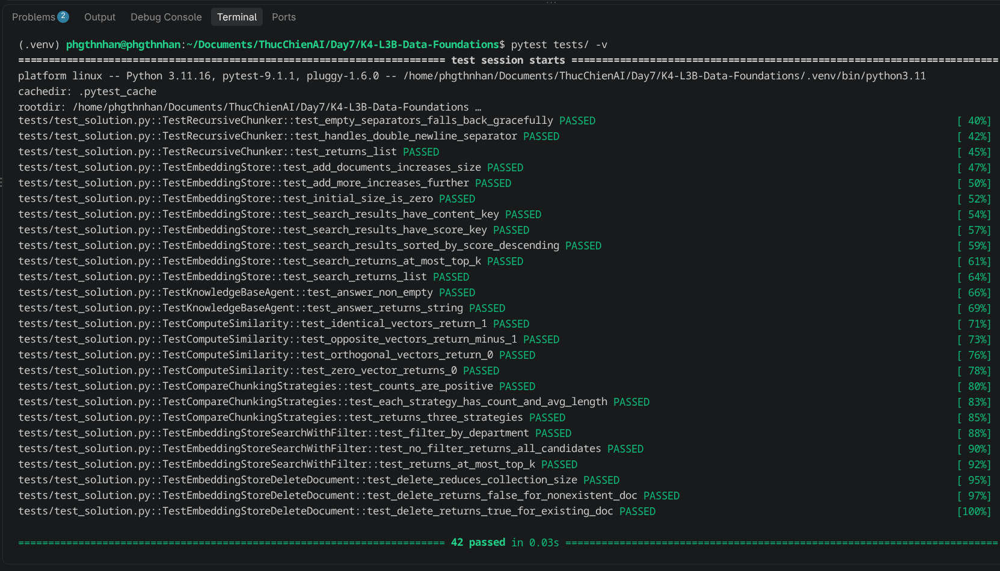

# Báo Cáo Cá Nhân — Lab 7: Embedding & Vector Store

**Họ tên:** Phùng Thành An
**Nhóm:** BLAS
**Ngày:** 20/09/2026

> **Nộp 1 bản / sinh viên.** Phần nhóm (lựa chọn tài liệu, thiết kế chiến lược, bộ câu hỏi đánh giá, demo) nộp chung 1 bản trong `REPORT_NHOM.md`. Chi tiết thang điểm: `docs/SCORING.md`.

**Tổng điểm phần cá nhân: 60** = Khởi động (5) + Hướng tiếp cận (10) + Hoàn thiện code (30) + Dự đoán độ tương tự (5) + Kết quả truy xuất của tôi (10).

---

## 1. Khởi động (Warm-up) — Cá nhân (5 điểm)

### Độ tương tự Cosine (Cosine Similarity) (Bài tập 1.1)

**Độ tương tự cosine cao (High cosine similarity) nghĩa là gì?**
> Cosine cao nghĩa là hai văn bản có hướng vector gần nhau, tức là nội dung hay ngữ nghĩa gần nhau

**Ví dụ có độ tương tự CAO:**
- Câu A: Tôi muốn trả lại hàng
- Câu B: Làm sao để hoàn sản phẩm
- Tại sao tương đồng: đều hướng đến việc muốn trả lại sản phẩm

**Ví dụ có độ tương tự THẤP:**
- Câu A: Tôi muốn trả lại hàng
- Câu B: Thời tiết hôm nay đẹp
- Tại sao khác: ý nghĩa của hai câu này khác nhau nên độ tương đồng thấp

**Tại sao độ tương tự cosine (cosine similarity) được ưu tiên hơn khoảng cách Euclid (Euclidean distance) cho text embeddings?**
> Tại vì cosine chỉ đo hướng, không bị ảnh hưởng bởi độ dài hay độ lớn vector
### Bài toán tính toán Chunking (Bài tập 1.2)

**Tài liệu 10,000 ký tự, chunk_size=500, overlap=50. Bao nhiêu chunks?**
> overlap=50: ceil((10000 − 50) / (500 − 50)) = ceil(22.11)
> 23 chunk

**Nếu độ chồng chéo (overlap) tăng lên 100, số lượng chunk thay đổi thế nào? Tại sao muốn độ chồng chéo nhiều hơn?**
> overlap=100: ceil((10000 − 100) / (500 − 100)) = ceil(24.75)
> 25 chunk
> Số chunk tăng từ 23 lên 25. Muốn overlap lớn hơn vì ranh giới hai chunk liền kề không bị cắt đứt ý, dù phải lưu và embed nhiều chunk hơn.

---

## 2. Hướng tiếp cận của tôi (My Approach) — Cá nhân (10 điểm)

### Các hàm chia nhỏ (Chunking Functions)

**`SentenceChunker.chunk`**
> Ban đầu mình định split theo `[.!?]\s+` nhưng làm vậy mất luôn dấu câu, chunk thành câu cụt. Đổi sang `(?<=[.!?])\s+` thì tách ngay sau dấu mà vẫn giữ được `.` `!` `?`. Xong strip, bỏ chuỗi rỗng, rồi ghép mỗi N câu (mặc định 3) thành một chunk. Text rỗng thì trả về list rỗng.
>
> Cái mình biết là chưa xử lý được: viết tắt kiểu `TS.`, `v.v.`, số thập phân, và trên file chính sách còn bị cắt ở `1.1.` vì regex nghĩ đó là hết câu. Tiêu đề Markdown không có dấu chấm đôi khi cũng dính sang câu sau. Tạm chấp nhận vì test không bắt case này; ghi ra cho rõ hơn là giấu.

**`RecursiveChunker.chunk` / `_split`**
> Ý chính là thử cắt thô trước (hai lần xuống dòng, rồi một lần xuống dòng, rồi chấm cách, rồi dấu cách), chỉ khi mảnh vẫn dài mới hạ xuống mức nhỏ hơn, cuối cùng mới cắt cứng theo độ dài. Có ba chỗ dừng: đoạn đã ngắn hơn `chunk_size`; hết separator hoặc separator rỗng thì cắt theo độ dài; mảnh sau khi tách vẫn dài thì gọi đệ quy tiếp.
>
> Phần dễ quên là gom các mảnh ngắn lại cho gần `chunk_size`. Lúc đầu mình chỉ đệ quy xuống, file nhiều dòng ngắn ra cả đống chunk 5–10 ký tự, search gần như vô dụng. Thêm bước gom thì ổn hơn hẳn.

### Lớp EmbeddingStore

**`add_documents` + `search`**
> Mình bỏ hẳn nhánh Chroma, chỉ giữ list trong RAM. Test không cần Chroma mà máy có package sẵn dễ đi nhầm nhánh lỗi. Mỗi document thành một record gồm id, content, metadata và embedding (tính lúc thêm vào).
>
> Lúc làm bench mới thấy quan trọng: `Document.id` là `file#0`, `file#1`… còn `metadata["doc_id"]` phải là tên file gốc để `delete_document` xóa hết chunk của file đó. Search dùng dot product (vector đã chuẩn hoá nên tương đương cosine), trả về content, score và metadata, không nhét vector vào kết quả cho đỡ rối khi in.

**`search_with_filter` + `delete_document`**
> Lọc metadata trước rồi mới rank. Thử ngược lại, lấy top-k rồi mới lọc, thì vài lần còn 0 kết quả vì cả 3 slot đã bị chunk sai `audience` chiếm. Với corpus buyer/seller của nhóm, cái này ảnh hưởng trực tiếp A/B ở Q2 đến Q4.
>
> `delete_document` duyệt lại store, bỏ record có `doc_id` khớp, trả về True nếu số phần tử giảm.

### Tác tử KnowledgeBaseAgent

**`answer`**
> Flow đơn giản: search top-k, ghép ngữ cảnh, rồi gọi `llm_fn`. Mình đánh số `[1] [2] [3]` và ghi kèm `doc_id` để lúc đọc câu trả lời biết lấy từ file hay chunk nào. Prompt ghi rõ chỉ được dùng ngữ cảnh; không có thì nói không biết, hạn chế model bịa.
>
> Có truyền `metadata_filter` thì đi `search_with_filter`, không thì `search`. Store rỗng hoặc filter không khớp ai thì trả câu cố định, không gọi LLM, vừa tránh hallucination vừa khỏi tốn token oan.
---

## 3. Hoàn thiện code (Core Implementation) — Cá nhân (30 điểm)

Vượt qua bộ kiểm thử là điều kiện tính điểm phần này.

### Kết Quả Kiểm Thử (Test Results)

**Số lượng bài test vượt qua (pass):** 42 / 42

---

## 4. Dự đoán độ tương tự (Similarity Predictions) — Cá nhân (5 điểm)

Embedding: `text-embedding-3-small` (OpenRouter). Điểm = cosine similarity qua `compute_similarity`.

| Cặp | Câu A | Câu B | Dự đoán | Điểm thực tế | Đúng? |
| --- | ----- | ----- | -------- | ------------ | ----- |
| 1 | Tôi muốn trả lại hàng vì sản phẩm lỗi | Làm sao để hoàn trả sản phẩm bị hỏng? | cao | 0.6868 | Có (cùng nghĩa, khác từ) |
| 2 | Người Mua có 15 ngày để gửi yêu cầu trả hàng | Người Bán phải nhận hàng hoàn trong 7 ngày làm việc | thấp / trung bình | 0.6874 | Không — điểm gần bằng cặp 1 dù đối tượng và số ngày khác |
| 3 | Thời hạn bảo hành tính từ ngày nhận hàng | Shopee không trực tiếp thực hiện nghĩa vụ bảo hành | trung bình | 0.4943 | Có (cùng chủ đề bảo hành, góc nhìn khác) |
| 4 | Trả hàng hoàn tiền trong vòng 15 ngày | Thời tiết hôm nay đẹp, trời nắng không mưa | thấp | 0.2875 | Có |
| 5 | Người Bán có trách nhiệm tiếp nhận bảo hành | Shop phải bảo hành sản phẩm theo cam kết đã đăng | cao | 0.5506 | Một phần (cao hơn cặp 3–4 nhưng thấp hơn kỳ vọng “cùng nghĩa”) |

**Kết quả nào bất ngờ nhất? Điều này nói gì về cách embeddings biểu diễn ý nghĩa?**

> Bất ngờ nhất là **cặp 2** (0.6874) gần bằng **cặp 1** (0.6868): một bên là thời hạn Người Mua (15 ngày), một bên là nghĩa vụ Người Bán (7 ngày), nhưng embedding vẫn xếp rất gần nhau vì cùng chủ đề “trả hàng / hoàn”. Embedding nhóm theo **chủ đề và từ vựng gần**, không phân biệt đối tượng hay con số trả lời được — đúng với lỗi Q2 trên bench: chunk “đúng chủ đề” dễ thắng chunk chứa đúng “6 ngày lịch”. Cặp 4 (0.2875) xác nhận chủ đề lệch thật sự thì điểm thấp rõ.
---

## 5. Kết quả truy xuất của tôi (Competition Results) — Cá nhân (10 điểm)

Chạy **5 câu hỏi đánh giá của nhóm** trên mã nguồn cá nhân (`RecursiveChunker`, embedding `text-embedding-3-small`). **5 câu hỏi trùng nhóm** (xem `REPORT_NHOM.md`).

| # | Câu hỏi (Query) | Top-1 Chunk truy xuất được (tóm tắt) | Điểm Score | Có liên quan không? (Relevant) | Câu trả lời của Agent (tóm tắt) |
| --- | --- | --- | --- | --- | --- |
| 1 | Người Mua có bao lâu để gửi yêu cầu trả hàng/hoàn tiền sau khi đơn được giao thành công? | `return-refund-policy#8`: Người Mua gửi yêu cầu trong vòng **15 (mười lăm) ngày** kể từ khi đơn cập nhật giao thành công; thực phẩm tươi/đông lạnh theo quy định riêng. | 0.7508 | Có | 15 ngày với hàng thường; thực phẩm tươi sống/đông lạnh trong 24 giờ (theo gold trong cùng file). |
| 2 | Trong Shopee Mall, sau khi yêu cầu trả hàng/hoàn tiền được chấp thuận, cần hoàn tất việc gửi hoặc nhận lại sản phẩm trong bao nhiêu ngày? | `return-refund-guide#4`: Thời gian hoàn tiền nếu yêu cầu được chấp nhận (1–14 ngày làm việc) — **cùng chủ đề nhưng không chứa “6 ngày lịch”**. | 0.7509 | Một phần (đúng chủ đề, sai số liệu) | Top-1 không đủ để trả “6 ngày lịch”; chunk đúng đáp án nằm #2 (`shopee-mall-buyer#6`). Agent dễ trả lời lệch sang thời gian hoàn tiền. |
| 3 | Khi Shopee yêu cầu bằng chứng cho yêu cầu trả hàng/hoàn tiền Shopee Mall, Người Bán phải cung cấp trong bao lâu? | `shopee-mall-seller#2`: Shopee có quyền yêu cầu Người Bán cung cấp bằng chứng trong quá trình xác minh (đáp án **tối đa 24 giờ**). | 0.7795 | Có | Người Bán phải cung cấp bằng chứng trong tối đa 24 giờ kể từ khi Shopee yêu cầu. |
| 4 | Ai chịu trách nhiệm tiếp nhận bảo hành sản phẩm cho Người Mua trên Shopee? | `warranty-general-seller#1`: **Người Bán** có trách nhiệm tiếp nhận bảo hành theo cam kết / nhà sản xuất; Shopee không phải bên thực hiện nghĩa vụ bảo hành (trừ hàng Shopee bán trực tiếp). | 0.7839 | Có | Người Bán chịu trách nhiệm tiếp nhận bảo hành; Shopee chỉ hỗ trợ, không thay người bán thực hiện bảo hành. |
| 5 | Đối với tranh chấp không phải khiếu nại trả hàng/hoàn tiền, Shopee đưa ra hướng giải quyết trong bao lâu sau khi nhận đủ tài liệu? | `dispute-resolution#5`: Phần quy trình tranh chấp ngoài Trả Hàng/Hoàn Tiền; hướng giải quyết trong **7 ngày làm việc** sau khi nhận đủ hồ sơ (vụ phức tạp có thể lâu hơn). | 0.7882 | Có | Trong vòng 7 ngày làm việc kể từ khi nhận đủ thông tin/tài liệu; vụ việc phức tạp có thể kéo dài hơn. |

**Bao nhiêu câu hỏi trả về chunk có liên quan trong top-3?** **5 / 5**  
(Trong đó 4/5 có đáp án đúng ở top-1 hoặc đủ để trả lời; Q2 có đáp án ở hạng #2, top-1 chỉ liên quan chủ đề.)

**Điều hay nhất tôi học được từ thành viên khác / nhóm khác (qua demo):**
> Filter `audience` không phải lúc nào cũng đổi top-1, nhưng với câu không nêu rõ người hỏi (Q2) thì bỏ filter dễ lấy nhầm điều khoản seller (“07 ngày”) hoặc hướng dẫn hoàn tiền chung. Chấm theo “đúng file gold” dễ thổi phồng điểm so với kiểm chunk có thật sự chứa số liệu trả lời — Recursive giữ số liệu tốt hơn Heading/FixedSize vì chunk nhỏ hơn.

---

## Tự Đánh Giá (Phần Cá Nhân)

| Tiêu chí | Điểm tự đánh giá |
|----------|-------------------|
| Khởi động (Warm-up) | 5 / 5 |
| Hướng tiếp cận của tôi (My Approach) | 10 / 10 |
| Hoàn thiện code (Core Implementation — tests) | 30 / 30 |
| Dự đoán độ tương tự (Similarity Predictions) | 5 / 5 |
| Kết quả truy xuất của tôi (Competition Results) | 9 / 10 |
| **Tổng phần cá nhân** | **59 / 60** |
